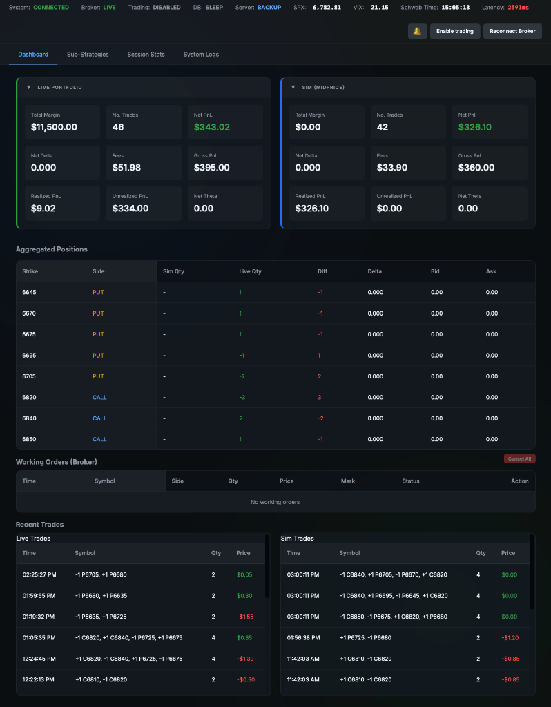
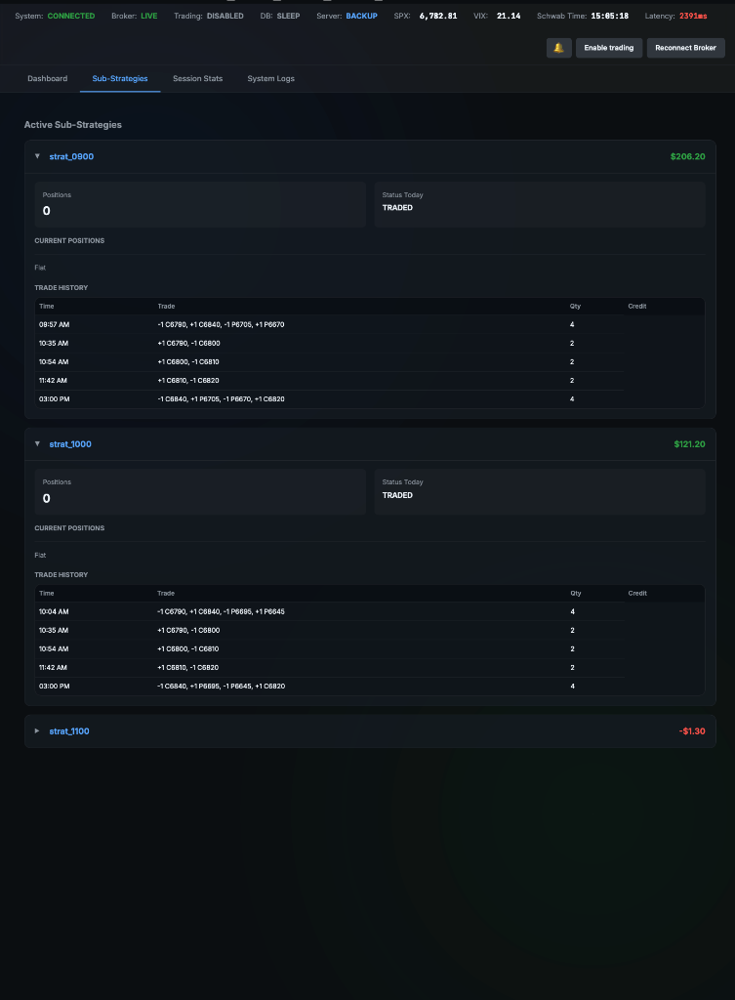
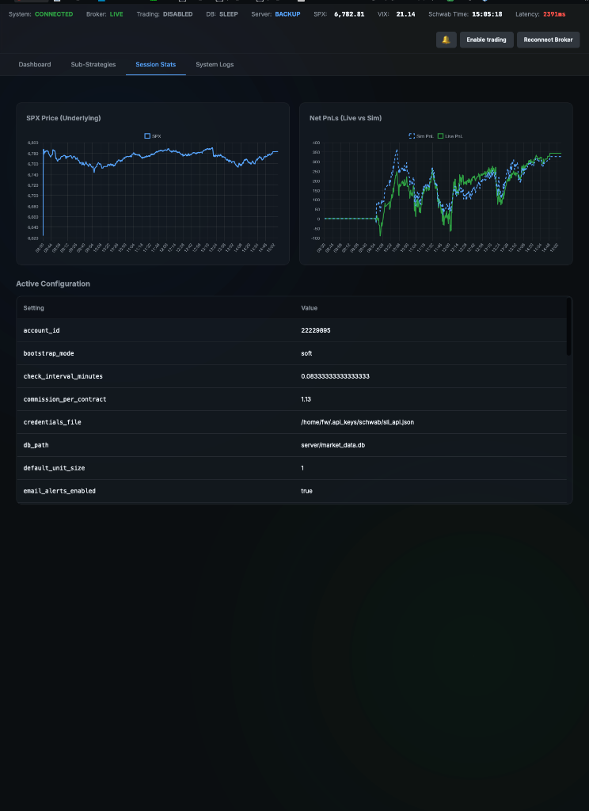
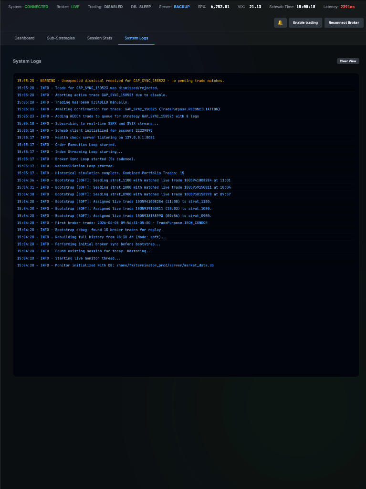
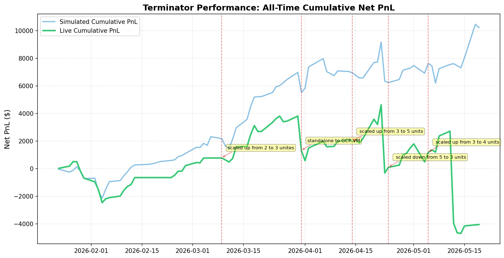

# 🤖 Terminator Production Trading Server

**Terminator** is a high-frequency, production-grade 0DTE options trading system. It integrates Schwab's API for live execution with a real-time web dashboard for strategy monitoring and manual trade oversight.

---

## 🚀 Key Features

### 📊 Real-Time Web Dashboard
- **Modern Responsive UI**: Dynamic grid layout that adjusts for any screen size (desktop to mobile-narrow).
- **Dual Portfolio Monitoring**: Parallel tracking of **Simulated** vs. **Live** portfolios with key metrics (Margin, Net PnL, Delta, Theta, Fees).
- **Sticky Greeks Architecture**: A decoupled sync system ensuring live Greeks (Delta/Theta) remain stable and accurate by separating 5s position refreshes from 30s market snapshots.
- **Foldable Controls**: One-click folding/unfolding of portfolio windows to clear clutter during complex sessions.

### 🛡️ Production Safety & Confirmation
- **Interactive Trade Modal**: High-visibility confirmation window for all live strategy executions.
- **Smart Countdown Timer**: 10-second auto-send countdown with visual urgency alerts (Orange at 6s, Red at 3s).
- **Pause & Override**: Immediate "Pause Timer" and "Dismiss Trade" controls to prevent unwanted executions.
- **Multi-Order Support**: Seamlessly handles strategies split across multiple broker orders (e.g., 6-leg splits) with aggregated pricing summaries.

### 🛠 Core Infrastructure
- **Unified Logic**: Shared monitor for catch-up simulations and live execution.
- **Schwab API Integration**: Native support for Schwab's asynchronous client with automatic heartbeat monitoring and VPN/DNS resilience.
- **Persistent Sessions**: Automated session state saving/loading via `SessionManager`.

---

## 🎨 Interface Showcase

<table border="0">
  <tr>
    <td width="50%"></td>
    <td width="50%"></td>
  </tr>
  <tr>
    <td width="50%"></td>
    <td width="50%"></td>
  </tr>
</table>

---

## 📂 Project Structure

```
terminator_prod/
│
├── server/                        # Production Server logic
│   ├── main.py                    # Entry point: FastAPI + Monitor Loop
│   ├── api/
│   │   ├── routes.py              # REST REST endpoint handlers
│   │   └── ws.py                  # Real-time WebSocket broadcaster
│   ├── core/                      # Trading Engine
│   │   ├── monitor.py             # LiveTradingMonitor (The Brain)
│   │   ├── models.py              # Portfolio & Option data classes
│   │   ├── config.py              # Configuration & Risk params
│   │   └── utils.py               # Spreading & Pricing logic
│   └── static/                    # Frontend Dashboard
│       ├── index.html             # UI Structure
│       ├── style.css              # Premium Dark Mode Theme
│       └── app.js                 # UI Logic & Modal Handling
│
├── deploy/                        # Infrastructure
│   └── terminator.service         # systemd unit for GCE
│
└── data/                          # Runtime logs, DBs, and session files
```

---

## 🚦 Getting Started

### 1. Local Development
1. **Initialize Environment**:
   ```bash
   python -m venv .venv && source .venv/bin/activate
   pip install -r requirements.txt
   ```
2. **Setup Credentials**:
   Ensure Schwab API keys are in `~/.api_keys/schwab/schwab_api.json`.
3. **Launch Terminal**:
   ```bash
   # Run the server locally on port 9000
   python3 server/main.py
   ```

### 2. Production Deployment (Both VMs)
Deployment is now unified across both the Primary and Backup VMs. Use the `full_deploy.sh` script which handles Git commits, multi-VM synchronization, and service restarts:

```bash
# Unified Git Commit, Sync, and Restart
./deploy/full_deploy.sh "Your commit message here"
```

The script will:
1.  **Commit** any uncommitted local changes to Git.
2.  **Archive** the project for deployment (excluding logs/DBs).
3.  **Detect** which VMs are running (`production-server` and `production-server-backup`).
4.  **Upload** code to all active VMs and **Restart** the services.

---

## 🔒 Security & Connectivity
- **Tailscale Only**: The dashboard is only accessible via the Tailscale VPN.
- **No Secrets**: Configuration uses `config.py` which is ignored by Git. Always use `config.example.py` as a template.
- **Health Checks**: A lightweight endpoint on `:8081` provides zero-latency heartbeats for external monitoring tools.


---
<!-- STATS_START -->

## 📈 Performance Statistics



| Period | Days | Total PnL | Trades/Day | Fees | Net PnL | Win % | Profit Factor | Sharpe | Max DD | Live OverTrade % | Live-Sim Net PnL Diff |
| :--- | :--- | :--- | :--- | :--- | :--- | :--- | :--- | :--- | :--- | :--- | :--- |
| Past 5D | 5 | $885.00 | 16.0 | $246.34 | **$638.66** | 60.0% | 1.58 | 3.06 | $-385.20 | 27.0% | $-1,028.76 |
| Past 22D | 22 | $2,002.50 | 21.2 | $841.85 | **$1,160.65** | 63.6% | 1.24 | 1.15 | $-3,225.81 | -0.6% | $-3,700.61 |
| YTD | 52 | $3,540.00 | 21.7 | $1,611.38 | **$1,928.62** | 55.8% | 1.25 | 1.11 | $-3,225.81 | -10.4% | $-5,247.40 |
| All Time | 52 | $3,540.00 | 21.7 | $1,611.38 | **$1,928.62** | 55.8% | 1.25 | 1.11 | $-3,225.81 | -10.4% | $-5,247.40 |


*Updated: 2026-04-09 11:14:44*

<!-- STATS_END -->