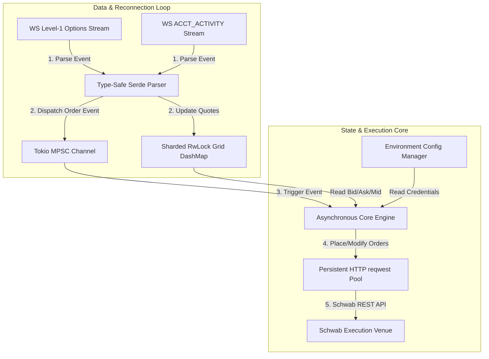

# 🦀 Terminator Rust App: Production Implementation Plan

This document outlines the corrected and enhanced technical blueprint for migrating the core live trading engine (**Terminator**) from Python to an asynchronous, ultra-low-latency **Rust** engine.

---

## 📊 High-Level Data Flow & State Engine



---

## ⚡ Core Architecture Details

### 1. **Option Pricing Grid State**
*   **Storage**: Uses `DashMap<OrderedFloat<f64>, OptionQuote>` representing the live option strikes grid. **Note**: Raw `f64` cannot be used as a `DashMap` key because Rust's standard library does not implement `Hash` or `Eq` for floating-point types (due to NaN semantics). The `ordered-float` crate provides `OrderedFloat<f64>`, which wraps `f64` with well-defined equality and hashing, making it safe to use as a map key. Strikes may also be stored as integer cents as an alternative.
*   **Concurrency Model**: Note that `DashMap` is **not lock-free**; it implements a concurrent hash table utilizing striped (sharded) `RwLock`s internally to minimize lock contention across threads.
*   **Performance**: Under normal execution, sharded lock writes/reads feature low-contention latency averages of **<0.1ms**, but do not guarantee lock-free worst-case execution. If lock-freedom becomes a hard bottleneck, it will be refactored into a ring-buffer or crossbeam-channel message dispatcher.

### 2. **Schwab WebSocket Connection & Reconnection Loop**
*   **Authentication Sequence**: Connects to the secure WebSocket endpoint (`wss://api.schwabapi.com/wss/v1`), sends the `login` protocol message using dynamically resolved credentials, and listens for the `SUBSCRIBED` confirmation.
*   **Reconnection & Resubscription Flow**:
    ```
    [WS Connection Loss] 
            │
            ▼
    [Exponential Backoff Sleep]
            │
            ▼
    [Establish TCP & TLS Handshake]
            │
            ▼
    [Send Handshake Login Request]
            │
            ▼
    [Await SUBSCRIBED Event]
            │
            ▼
    [RE-SEND Dynamic Option Symbol & Account Activity Subs]
            │
            ▼
    [Resume Live Streaming]
    ```
*   **Critical Safeguard**: Simply reconnecting is insufficient. The WS Stream Manager *must* track all active subscriptions in an in-memory registry and re-send the level-one options and account activity subscriptions immediately upon every successful re-authentication.

### 3. **Dynamic Environment Configuration**
*   **Zero Hardcoded Secrets**: Sensitive data, absolute token paths, and accounts are completely abstracted using `dotenvy` (for `.env` profile loading) and `config` (for structured system variables).
*   **Profile Swapping (Dev vs. Prod)**:
*   **Developer Sandbox (Default)**: Uses `schwab_api.json` / `schwab_token.json` for account `SCHWAB_DEV_ACCOUNT` to safely test all logic and execution routing.
*   **Live Production**: Swaps environment parameters to load `sli_api.json` / `sli_token.json` for account `SCHWAB_PROD_ACCOUNT`.

### 4. **Dynamic Sliding-Window Subscription & Greeks Engine**
*   **Dynamic Symbol Discovery Mapping**: At startup, the Rust engine performs a *single* `GET /chains` REST call for `$SPX` 0DTE to populate an in-memory `HashMap<StrikeAndSide, String>` mapping strike prices and call/put sides to their respective Schwab option symbols.
*   **Sliding-Window Option Subscriptions**: 
    *   Instead of subscribing to a large static list, the WS manager subscribes to the live `$SPX` index price.
    *   As the SPX price moves, we dynamically subscribe to options within a configurable window from ATM to OTM:
        *   **Puts range**: `[SPX_Price - OTM_Offset, SPX_Price]` (default offset = 50 points)
        *   **Calls range**: `[SPX_Price, SPX_Price + OTM_Offset]` (default offset = 50 points)
    *   **Throttling Buffer Zone**: To prevent high-frequency sub/unsub churn, subscription updates are only re-calculated and pushed to the Schwab stream if the SPX price moves beyond a configurable buffer limit (default = 10 points) from the center of the currently subscribed window.
*   **Greeks Engine**:
    *   **Style Suitability**: **Verified**. SPX options are European-style, cash-settled contracts, making the **Black-Scholes-Merton (BSM)** model perfectly suited and mathematically accurate.
    *   **Delta**: Calculated locally using standard BSM formulas (solving for cumulative normal distribution of $d_1$).
    *   **Theta**: For 0DTE options, we use the Schwab/industry convention: approximating Theta directly as the **midprice of the option contract** itself (since it decays to exactly 0 or intrinsic value by expiration).
    *   **Update Loop**: When `$SPX` index price updates stream in via WebSocket, we instantly recalculate Delta for all watched options in microseconds and update the concurrent `DashMap` pricing grid.

---

## ⚡ Technical Stack & Dependencies

The dependencies in `Cargo.toml` are configured as follows:
*   **tokio (v1.38)**: Full asynchronous multithreaded runtime.
*   **tokio-tungstenite**: Modern WebSocket client engine. *(Verify exact version against crates.io at `cargo add` time — latest stable may differ from v0.24.)*
*   **reqwest (v0.12)**: Persistent client pooling for execution REST endpoints.
*   **serde / serde_json**: Super-fast JSON parsing and validation.
*   **anyhow / thiserror**: Unified error handling. `thiserror` manages type-safe library-level errors, while `anyhow` propagates application-level runtime failures in the main loop.
*   **dashmap (v5.5)**: Concurrent, sharded hash map for low-contention options pricing grid.
*   **arc-swap (v1.7)**: Thread-safe atomic pointer reference swapping for token updates.
*   **dotenvy (v0.15) & config (v0.14)**: Profile-based configurations for dev/prod swap.
*   **chrono (v0.4)**: Wall-clock timestamps for log output and date math.
*   **ordered-float (v4)**: Provides `OrderedFloat<f64>` with `Hash` + `Eq` implementations, required to use `f64` strike prices as `DashMap` keys safely.
*   **ratatui (v0.26) & crossterm (v0.27)**: Terminal UI library for rendering the live options grid dashboard.

---

## 📅 Step-by-Step Porting Phase Plan

### **Phase 1: Configuration & Token Manager**
1. Implement the configuration loading layer utilizing `dotenvy` and `config`.
2. Port token reading and parsing logic. Establish an asynchronous background token refresh loop that wakes up every 25 minutes to refresh access tokens.
3. Expose the active token via a thread-safe `arc_swap::ArcSwap` atomic pointer to ensure zero-contention access.

### **Phase 2: WebSocket Core & Resubscription Engine**
1. Implement the WebSocket event loop using `tokio-tungstenite`.
2. Implement the full reconnection logic with exponential backoff and dynamic **resubscription registry** tracking current subscribed options.
3. Establish robust unit tests to verify connection states, error propagation, and handshake parsing in isolation. *(Note: Option/Account parser validation and DashMap integration is deferred to Phase 3 due to downstream coupling).*

### **Phase 3: Real-Time Options Grid & TUI**
1. Setup the concurrent striped `DashMap` storage mapping SPX strikes to bid-ask-mid structures.
2. Build the parsing logic to filter streaming updates and update the map.
3. Integrate `ratatui` + `crossterm` to construct a real-time console layout displaying the Call/Put options grid, status, and account activity updates.
4. **Unit testing**: Mock incoming streaming TCP payloads to verify parser resilience, strike filters, midpoint calculation correctness, and concurrent DashMap write accuracy in isolation.

### **Phase 4: Account Activity Stream & Parser**
1. Subscribe to `ACCT_ACTIVITY` feed using the active account configuration.
2. Construct strictly typed Rust deserializers (`serde`) matching all Schwab event structures (`OrderCreated`, `OrderAccepted`, `ExecutionRequested`, `OrderUROutCompleted`, `ExecutionCreated`).
3. Set up a tokio `mpsc` channel to forward order events to the trading engine.

### **Phase 5: Execution Core & Strategy Port (Critical Complexity)**
1. **Core State Machine**: Map all strategy states from `monitor.py` into a type-safe enum-driven Rust State Machine (e.g., `State::Idle`, `State::EnteringSpread`, `State::Working`, `State::Exiting`).
2. **Order Outbox Router**: Design a concurrent order dispatcher using persistent `reqwest::Client` connection pools.
3. **Spread Verification Engine**: Port validation logic to verify credit spreads against the strike differences to avoid rejections (e.g., matching the logic that rejected the spread in our Python test).
4. **Safety & Hazard Checks**:
   * **Max Slippage Checker**: Rejects fills outside specific deviation boundaries.
   * **Unintended Multi-leg Fills Mitigation**: Implements immediate cancellation commands or defensive hedging rules if a leg hangs or fails to execute.
   * **Stale Quote Guard**: Block trades if the latest option update in the `DashMap` is older than 500ms. Each `OptionQuote` entry stores a `std::time::Instant` timestamp updated on every write; `Instant::elapsed()` is used to measure staleness. (`chrono` is not used here — it is for wall-clock/calendar work; `Instant` is the correct type for measuring elapsed duration within a running process.)

---

## 🧪 Comprehensive Testing Strategy

### **1. Unit & Deserialization Testing**
*   Create a robust test suite under `/tests` utilizing raw JSON payloads captured from actual Schwab streams (including the order event templates we saved).
*   Test parser edge cases, missing fields, and custom decimal validation.

### **2. Mock Stream Integration Testing**
*   Create a mock WebSocket server that streams controlled mock quote datasets to verify the resubscription state, parsing velocity, and reconnection backoff timings.

### **3. Dry-Run Verification**
*   Develop a `DRY_RUN` configuration flag. When set, the Rust engine fully boots, streams live data, and executes internal strategy decisions, but bypasses the final REST order placement endpoint—simply logging the action.

### **4. Dev Account Sandbox Testing**
*   Execute active order flows using the developer credentials (`schwab_api.json`) on the margin account `SCHWAB_DEV_ACCOUNT` to verify order execution under live market conditions before pushing to production.
